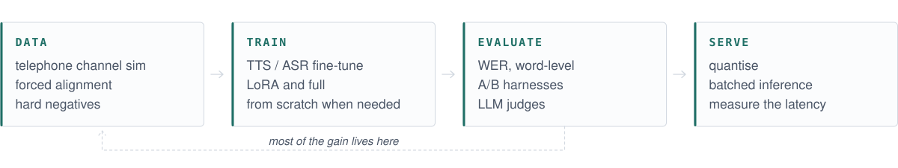

<picture>
  <source media="(prefers-color-scheme: dark)" srcset="assets/banner-dark.svg">
  
</picture>

### Ömer Yentür

Speech AI. Text to speech, speech recognition, and the pipeline around them.
Mostly Turkish.

<picture>
  <source media="(prefers-color-scheme: dark)" srcset="assets/loop-dark.svg">
  
</picture>

I train speech models, sometimes from scratch when a pretrained one does not fit.

Then I make them fast enough to be worth deploying.

I measure before I believe it.

On the side: Turkish e-commerce search relevance. Cross-encoders, GBDT stacking,
LLM judges.

**Working with** &nbsp;PyTorch · MLX · vLLM · CTranslate2 · ONNX Runtime · sherpa-onnx · LightGBM

mr.yentur@gmail.com
