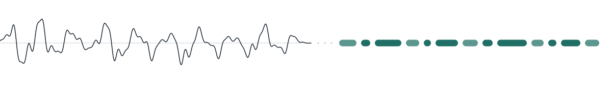

<picture>
  <source media="(prefers-color-scheme: dark)" srcset="assets/banner-dark.svg">
  
</picture>

### Ömer Yentür

I build speech systems: text-to-speech, speech recognition, and the training and
serving pipelines around them. Most of my work is on Turkish, where the pretrained
models are weaker and the interesting problems are in the data rather than the
architecture.

---

### What I work on

**Speech.** Fine-tuning and training TTS and ASR models, down to training small ones
from scratch when the pretrained options do not fit. Around the models: voice cloning
and speaker adaptation, forced alignment, VAD, diarization, and the data work that
decides whether any of it survives contact with real audio. A lot of that is telephone
audio, so channel simulation, codec artefacts and packet loss get more of my attention
than they probably deserve.

**Making it run.** Getting a model from a checkpoint to something with acceptable
latency and cost. Quantisation, batched inference, custom serving runtimes, and
measuring throughput honestly rather than quoting the number from the paper.

**Language models.** LoRA and full fine-tunes, retrieval evaluation, LLM-as-judge
setups for ranking and relevance, and agent harnesses. Mostly applied: the question is
usually whether a smaller tuned model beats a larger prompted one on the actual task,
and that is an experiment, not an opinion.

**Ranking and competitions.** Search relevance and classification, mostly Turkish
e-commerce. Cross-encoders, GBDT stacking on interaction features, embedding
similarity, and LLM judges for the pairs a cheap model cannot settle. Two things
generalised out of it. Mining hard negatives that match the real candidate
distribution moved the score far more than any architecture change did. And a
relabelled training split scored 0.92 on its own validation while losing six points on
the real leaderboard, which is a useful reminder that a label source can be measured
too, not just a model.

**Evaluation.** Building the benchmark before the model, because a speech or retrieval
system that has not been measured on its real distribution is a guess. Word-level error
analysis, A/B harnesses, synthetic corpora where real data is missing. Most of what I
have learned came from an experiment that looked like a win locally and was not one.

Before speech I worked on the ordinary machine learning surface: image segmentation,
reinforcement learning, gradient boosting, swarm optimisation. Some of those repos are
old and I have left them alone rather than tidy them up.

Outside all of that: an anomaly detector for log and audit data, a couple of games in
Godot, a native macOS utility in Swift, and some robotics simulation. Not my day job,
useful for staying honest about how much of engineering is not machine learning.

---

### Working with

Speech and audio — VoxCPM, Spark-TTS, Whisper and Qwen3-ASR fine-tuning, VAD,
diarization, forced alignment, codec and channel simulation.

Models and training — PyTorch, transformers, LoRA and full fine-tunes, multi-GPU
(FSDP, DDP), MLX on Apple silicon, cross-encoders, LightGBM.

Serving — vLLM, CTranslate2, ONNX Runtime, sherpa-onnx, batched custom runtimes.

---

mr.yentur@gmail.com
